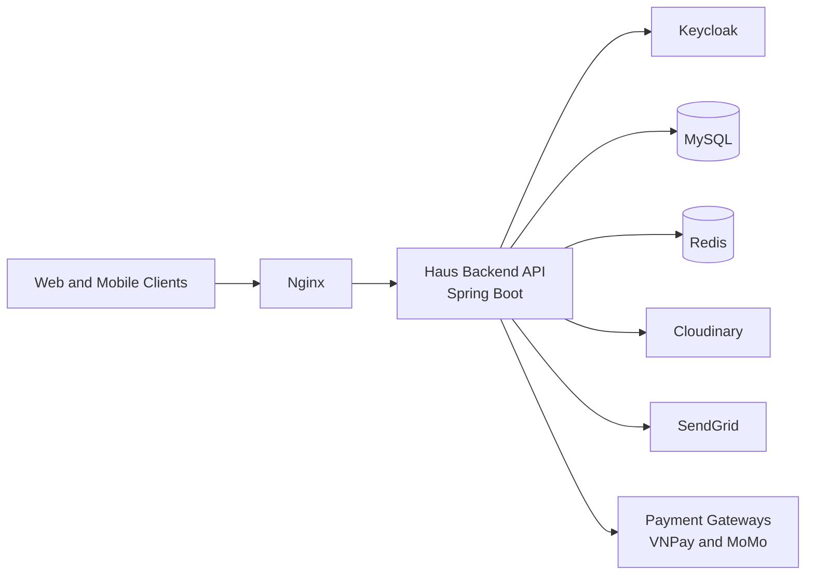

[](https://adoptium.net/)
[](https://spring.io/projects/spring-boot)
[](https://www.mysql.com/)
[](https://redis.io/)
[](https://www.docker.com/)
[](https://github.com/features/actions)

# Haus

Backend REST API for an e-commerce platform selling furniture and home decor.  
Live: https://haus.net.in/  
API Docs: https://haus.net.in/swagger-ui/index.html

---

## Tech Stack

| Layer | Technology |
| --- | --- |
| Framework | Spring Boot 3.5, Java 17 |
| Auth | Keycloak 26.1, JWT, OAuth2 |
| Database | MySQL 8.0, Spring Data JPA |
| Cache | Redis 7 |
| Storage | Cloudinary |
| Email | SendGrid |
| Payment | VNPay, MoMo, COD |
| Security | Rate limiting (Bucket4j), ClamAV scan |
| Docs | SpringDoc OpenAPI (Swagger) |
| Deploy | Docker, Docker Compose, Nginx |

---

## System Architecture



---

## Getting Started

### Prerequisites

- Java 17+
- Maven 3.9+
- Docker

### Run Locally (Docker)

```bash
cp .env.example .env
# fill in .env values
docker compose up -d
```

### Run With Maven

```bash
mvn spring-boot:run -Pdev
```

---

## API Documentation

Swagger UI: https://haus.net.in/swagger-ui/index.html

---

## Contributors

- @Cuonq2912
- @quankane
- @Nguyenthithuhang0406
